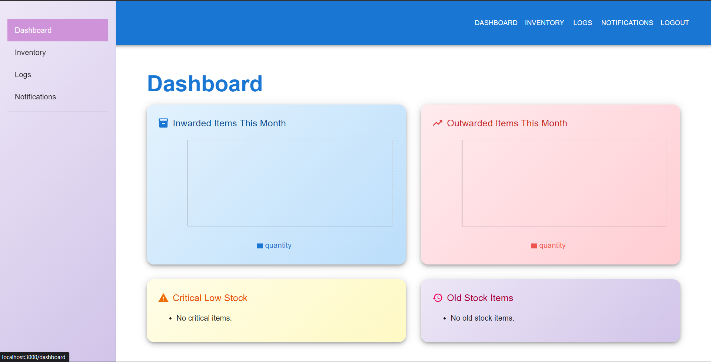
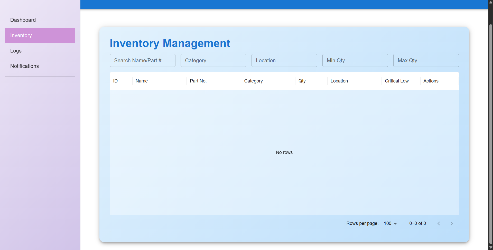

# LIMS Inventory Management System

A full-stack web application to track, manage, and log electronic components in a lab setting. It provides role-based access, real-time inventory updates, component logs, and notifications.

---

## Setup and Run Instructions (Local Environment)

1. Clone the repository  
   ```bash
   git clone https://github.com/yourusername/LIMS-INVENTORY.git
   cd LIMS-INVENTORY
   ```

2. Backend setup  
   - Navigate to the backend folder  
     ```bash
     cd backend
     ```  
   - Copy the example environment file and fill in your local values  
     ```bash
     cp utils/.env.example utils/.env
     ```  
     Update `utils/.env` with your PostgreSQL credentials and preferred port.  
   - Install dependencies and start the server  
     ```bash
     npm install
     npm start
     ```  
     Backend runs by default on `http://localhost:5000`.

3. Frontend setup  
   - Open a new terminal and navigate to the frontend folder  
     ```bash
     cd frontend
     ```  
   - Create a `.env` at the project root with:  
     ```
     REACT_APP_API_URL=http://localhost:5000
     ```  
   - Install dependencies and start the React app  
     ```bash
     npm install
     npm start
     ```  
     Frontend runs by default on `http://localhost:3000`.

4. Database initialization  
   - Ensure PostgreSQL is running locally  
   - Create a database named `lims` (or the name in your `.env`)  
     ```sql
     CREATE DATABASE lims;
     ```
   - (Optional) Run any ORM migrations or seed scripts if available  
     ```bash
     npx sequelize-cli db:migrate
     npx sequelize-cli db:seed:all
     ```

---

## Architecture and Technology Choices

- Backend  
  - Node.js with Express framework  
  - Sequelize ORM connecting to PostgreSQL  
  - JWT-based authentication and role-based authorization  
  - Modular controllers, routes, and middleware

- Frontend  
  - React with React Router for client-side navigation  
  - Material UI component library for consistent styling  
  - Axios-based service layer (`src/services/*.js`) for API calls  
  - Protected layouts and routes for authenticated views

---

## Description of Implemented Features

- User registration, login, and role selection (User vs. Admin)  
- CRUD operations on components  
- Inventory dashboard with low-stock and old-stock alerts  
- Component check-in/check-out log entries  
- Notifications center for system events  
- User management (Admin only)  
- Responsive sidebar and navbar layout  

---

## Credentials and User Roles

| Role  | Username   | Password    | Access                                         |
|-------|------------|-------------|------------------------------------------------|
| Admin | admin      | admin123    | Full access: user management, inventory, logs  |
| User  | user       | user123     | View inventory, add logs, view own profile     |

To seed these accounts, you can insert directly into the database or use ORM seed files if provided.

---

## Screenshots of Key Functionalities

  
  
  

> Replace `docs/screenshots/...` with your actual paths or hosted image URLs.

---

## Known Limitations and Future Improvements

- No Docker/Docker Compose setup for one-click local development  
- Lacks automated end-to-end testing (Cypress, Playwright)  
- Basic notification system; consider integrating email/SMS channels  
- No real-time updates (WebSockets) for collaborative usage  
- UI enhancements: bulk actions, filtering by category, export to CSV  

Feel free to contribute any fixes or proposals via pull requests!
